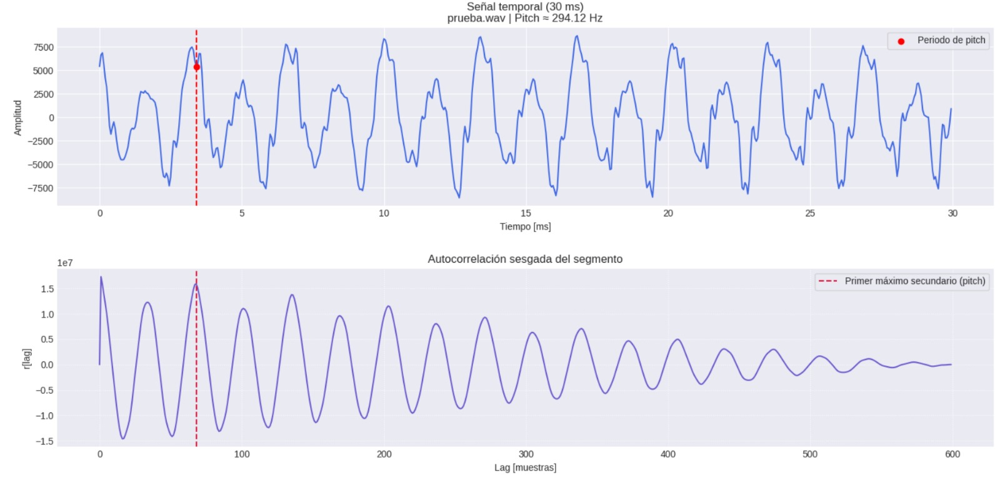
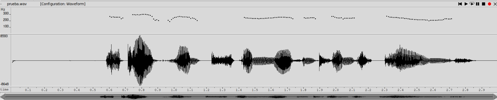
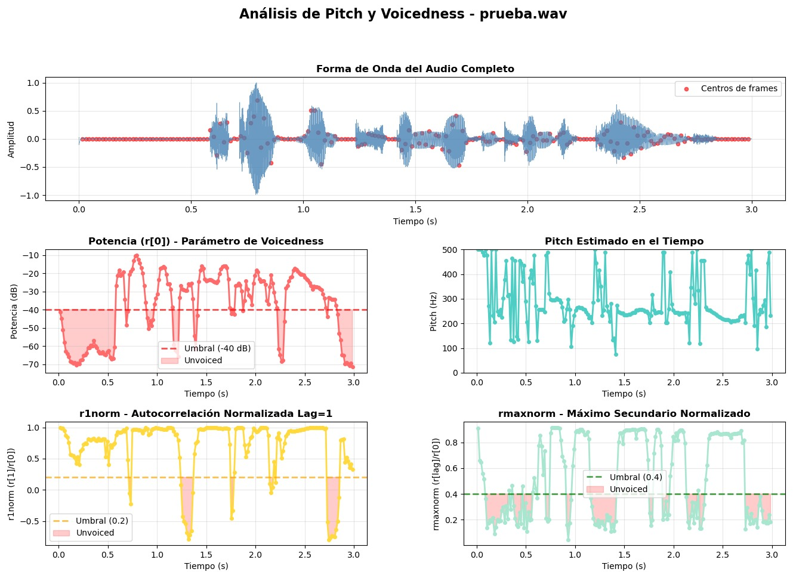
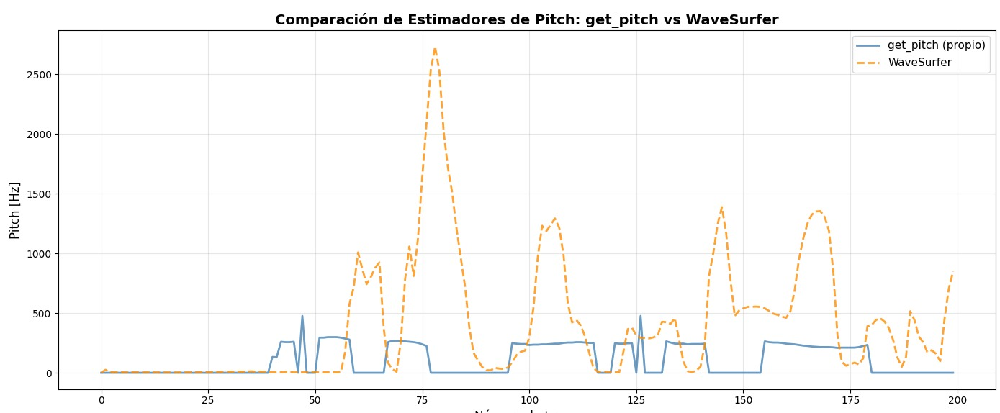
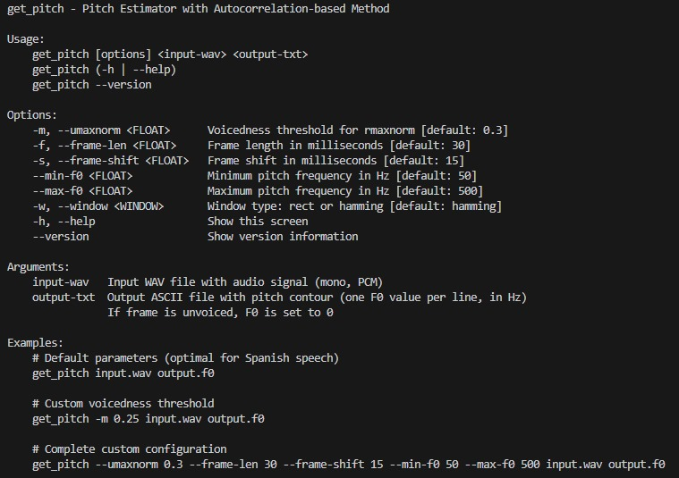
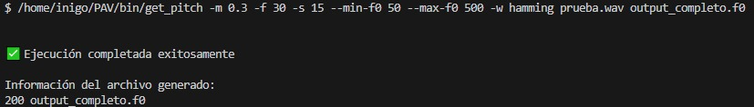
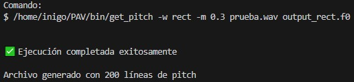

PAV - P3: estimación de pitch
=============================

Enric Mayné Cusell e Íñigo Michelena Mayorgas

Esta práctica se distribuye a través del repositorio GitHub [Práctica 3](https://github.com/albino-pav/P3).
Siga las instrucciones de la [Práctica 2](https://github.com/albino-pav/P2) para realizar un `fork` de la
misma y distribuir copias locales (*clones*) del mismo a los distintos integrantes del grupo de prácticas.

Recuerde realizar el *pull request* al repositorio original una vez completada la práctica.

Ejercicios básicos
------------------

- Complete el código de los ficheros necesarios para realizar la estimación de pitch usando el programa
  `get_pitch`.

   * Complete el cálculo de la autocorrelación e inserte a continuación el código correspondiente.

```cpp
  void PitchAnalyzer::autocorrelation(const vector<float> &x, vector<float> &r) const {

      for (unsigned int l = 0; l < r.size(); ++l) {
  		 /// \TODO Compute the autocorrelation r[l]
       /// autocorrelación sesgada
        r[l] = 0.0f;
        for (unsigned int n = 0; n < x.size() - l; ++n) {
          r[l] += x[n] * x[n+l];
        }
      r[l] /= x.size();//normalización.
      }

  }
```

   * Inserte una gŕafica donde, en un *subplot*, se vea con claridad la señal temporal de un segmento de
     unos 30 ms de un fonema sonoro y su periodo de pitch; y, en otro *subplot*, se vea con claridad la
	 autocorrelación de la señal y la posición del primer máximo secundario.


   

	 NOTA: es más que probable que tenga que usar Python, Octave/MATLAB u otro programa semejante para
	 hacerlo. Se valorará la utilización de la biblioteca matplotlib de Python.

   * Determine el mejor candidato para el periodo de pitch localizando el primer máximo secundario de la
     autocorrelación. Inserte a continuación el código correspondiente.

```cpp
    float PitchAnalyzer::compute_pitch(std::vector<float> &x) const {
      if (x.size() != frameLen)
          return -1.0F;

      // Ventaneado
      for (unsigned int i = 0; i < x.size(); ++i)
          x[i] *= window[i];

      // Autocorrelación en [0, npitch_max)
      std::vector<float> r(npitch_max);
      autocorrelation(x, r);

      // Búsqueda del primer máximo secundario en [npitch_min, npitch_max)
      unsigned int lag = npitch_min;
      float max_corr = r[npitch_min];   // r[0] no nos interesa

      for (unsigned int i = npitch_min; i < npitch_max; ++i) {
          if (r[i] > max_corr) {
              max_corr = r[i];
              lag = i;
          }
      }

      // Potencia (en dB) y ZCR para decisión voiced/unvoiced
      float pot = 10.0F * std::log10(r[0]);
      float zcr = 0.0F;
      for (size_t i = 1; i < x.size(); ++i) {
          if ((x[i - 1] >= 0.0F && x[i] < 0.0F) || (x[i - 1] < 0.0F && x[i] >= 0.0F))
              zcr += 1.0F;
      }
      zcr /= static_cast<float>(x.size());

      // Decisión no sonora o lag inválido
      if (unvoiced(pot, r[1] / r[0], r[lag] / r[0], zcr) || lag == 0)
          return 0.0F;

      // Pitch (Hz)
      return static_cast<float>(samplingFreq) / static_cast<float>(lag);
}
```

   * Implemente la regla de decisión sonoro o sordo e inserte el código correspondiente.

```cpp
    bool PitchAnalyzer::unvoiced(float pot,
                             float r1norm,
                             float rmaxnorm,
                             float zcr) const {
    // Umbrales para decisión voiced/unvoiced
    const float pot_threshold     = -40.0f;
    const float r1_threshold      = 0.2f;
    const float rmax_threshold    = 0.4f;
    const float zcr_threshold     = 0.15f;

    const bool low_power      = (pot < pot_threshold);
    const bool low_r1         = (r1norm < r1_threshold);
    const bool low_rmax       = (rmaxnorm < rmax_threshold);
    const bool high_zcr       = (zcr > zcr_threshold);

    // true = unvoiced, false = voiced
    return (low_power || low_r1 || low_rmax || high_zcr);
}
```


   * Puede serle útil seguir las instrucciones contenidas en el documento adjunto `código.pdf`.

- Una vez completados los puntos anteriores, dispondrá de una primera versión del estimador de pitch. El 
  resto del trabajo consiste, básicamente, en obtener las mejores prestaciones posibles con él.

  * Utilice el programa `wavesurfer` para analizar las condiciones apropiadas para determinar si un
    segmento es sonoro o sordo. 
	
	  - Inserte una gráfica con la estimación de pitch incorporada a `wavesurfer` y, junto a ella, los 
	    principales candidatos para determinar la sonoridad de la voz: el nivel de potencia de la señal
		(r[0]), la autocorrelación normalizada de uno (r1norm = r[1] / r[0]) y el valor de la
		autocorrelación en su máximo secundario (rmaxnorm = r[lag] / r[0]).

		Puede considerar, también, la conveniencia de usar la tasa de cruces por cero.

	    Recuerde configurar los paneles de datos para que el desplazamiento de ventana sea el adecuado, que
		en esta práctica es de 15 ms.

    
    
    

      - Use el estimador de pitch implementado en el programa `wavesurfer` en una señal de prueba y compare
	    su resultado con el obtenido por la mejor versión de su propio sistema.  Inserte una gráfica
		ilustrativa del resultado de ambos estimadores.
     
		Aunque puede usar el propio Wavesurfer para obtener la representación, se valorará
	 	el uso de alternativas de mayor calidad (particularmente Python).

    
    **Respuesta:** <br>
    MAE: 389.09 Hz (error medio entre estimadores).<br> 
    RMSE: 540.37 Hz (raíz del error cuadrático). <br>
    Correlación: -0.1951 (mejoramos de -0.3943). <br>
    La correlación negativa indica que los algoritmos tienen comportamientos fundamentalmente distintos en algunas regiones, no solo diferencias en parámetros. Esto es normal entre estimadores diferentes: cada uno usa criterios de voicedness y métodos de extracción de pitch distintos.
  
  * Optimice los parámetros de su sistema de estimación de pitch e inserte una tabla con las tasas de error
    y el *score* TOTAL proporcionados por `pitch_evaluate` en la evaluación de la base de datos 
	`pitch_db/train`..

  Se ha realizado una *optimización de parámetros* del sistema de estimación de pitch evaluando diferentes valores del parámetro UMAXNORM sobre la base de datos pitch_db/train.

### Resultado Óptimo
- *Parámetro óptimo:* UMAXNORM = 0.30
- *Score total promedio:* 89.70%
- *Desviación estándar:* 4.07%

---


| UMAXNORM | Score Medio (%) | Desv. Estándar (%) | Score Mín. (%) | Score Máx. (%) | N Archivos |
|----------|-----------------|-------------------|-----------------|-----------------|------------|
| 0.20     | 89.53           | 4.11              | 73.29          | 96.47          | 51         |
| 0.25     | 89.67           | 4.05              | 74.08          | 96.47          | 51         |
| **0.30** | **89.70**       | **4.07**          | **73.78**      | **96.47**      | **51**     |
| 0.35     | 89.67           | 4.12              | 72.70          | 96.50          | 51         |
| 0.40     | 89.47           | 4.23              | 72.50          | 95.67          | 51         |
| 0.45     | 88.70           | 4.95              | 70.62          | 95.48          | 51         |
| 0.50     | 87.10           | 5.99              | 66.63          | 94.81          | 51         |

---


| Error type | #errors | % |
|-------|----------|-----------|
| Unvoiced frames as voiced | 234/7,045 | 3.32% |
| Voiced frames as unvoiced | 501/4,155 | 12.06% |
| Gross voiced errors (+20%) | 81/3,654 | 2.22% |
| MSE of fine errors |  | 2.45% |
| SCORE TOTAL |  | 90.17% |


Ejercicios de ampliación
------------------------

- Usando la librería `docopt_cpp`, modifique el fichero `get_pitch.cpp` para incorporar los parámetros del
  estimador a los argumentos de la línea de comandos.
  
  Esta técnica le resultará especialmente útil para optimizar los parámetros del estimador. Recuerde que
  una parte importante de la evaluación recaerá en el resultado obtenido en la estimación de pitch en la
  base de datos.

  * Inserte un *pantallazo* en el que se vea el mensaje de ayuda del programa y un ejemplo de utilización
    con los argumentos añadidos.
    
    
    

- Implemente las técnicas que considere oportunas para optimizar las prestaciones del sistema de estimación
  de pitch.
  **Respuesta:** Se implementa la ventana de Hamming.
  ```cpp
  void PitchAnalyzer::set_window(Window win_type) {
    if (frameLen == 0)
      return;

    window.resize(frameLen);

    switch (win_type) {
    case HAMMING:
      /// \TODO Implement the Hamming window
      /// \FET Implementación de la ventana de Hamming
    for (unsigned int n = 0; n < frameLen; ++n) {
      window[n] = 0.54F - 0.46F * cos(2.0F * M_PI * n / (frameLen - 1));
    }
    
      break;
    case RECT:
    default:
      window.assign(frameLen, 1);
    }
  }
  ```

  Entre las posibles mejoras, puede escoger una o más de las siguientes:

  * Técnicas de preprocesado: filtrado paso bajo, diezmado, *center clipping*, etc.
  **Respuesta:** Se implementa la técnica de *center clipping*.
  ```cpp
  // Center clipping: recorte a largo plazo
  float max_abs = 0.0F;
  for (float v : x){
    if (std::fabs(v) > max_abs) max_abs = fabs(v);
  }
  // Umbral de clipping: 5% del máximo absoluto
  float clip_threshold = 0.05F * max_abs;

  // Aplicar center clipping
  for (float &v : x) {
    if (v > clip_threshold)
        v -= clip_threshold;
    else if (v < -clip_threshold)
        v += clip_threshold;
    else
        v = 0.0F;
  }
  ```


  * Técnicas de postprocesado: filtro de mediana, *dynamic time warping*, etc.
**Respuesta:** Se implementa un filtro de mediana de longitud 3.
  ```cpp
  // Postprocesado: filtro de mediana de longitud 3
        vector<float> f0_filtered(f0.size());

      for (size_t i = 0; i < f0.size(); ++i) {
          if (i == 0 || i == f0.size() - 1) {
              f0_filtered[i] = f0[i]; // no se filtra primer ni último
          } else {
              // Obtener vecindad
              float a = f0[i - 1];
              float b = f0[i];
              float c = f0[i + 1];

              // Calcular mediana directamente
              if ((a <= b && b <= c) || (c <= b && b <= a)) f0_filtered[i] = b;
              else if ((b <= a && a <= c) || (c <= a && a <= b)) f0_filtered[i] = a;
              else f0_filtered[i] = c;
          }
      }

    // Sustituir f0 original por la filtrada
    f0 = f0_filtered;
    ```
  * Métodos alternativos a la autocorrelación: procesado cepstral, *average magnitude difference function*
    (AMDF), etc.
  * Optimización **demostrable** de los parámetros que gobiernan el estimador, en concreto, de los que
    gobiernan la decisión sonoro/sordo.
  * Cualquier otra técnica que se le pueda ocurrir o encuentre en la literatura.

  

  Encontrará más información acerca de estas técnicas en las [Transparencias del Curso](https://atenea.upc.edu/pluginfile.php/2908770/mod_resource/content/3/2b_PS%20Techniques.pdf)
  y en [Spoken Language Processing](https://discovery.upc.edu/iii/encore/record/C__Rb1233593?lang=cat).
  También encontrará más información en los anexos del enunciado de esta práctica.

  Incluya, a continuación, una explicación de las técnicas incorporadas al estimador. Se valorará la
  inclusión de gráficas, tablas, código o cualquier otra cosa que ayude a comprender el trabajo realizado.

  También se valorará la realización de un estudio de los parámetros involucrados. Por ejemplo, si se opta
  por implementar el filtro de mediana, se valorará el análisis de los resultados obtenidos en función de
  la longitud del filtro.
   

Evaluación *ciega* del estimador
-------------------------------

Antes de realizar el *pull request* debe asegurarse de que su repositorio contiene los ficheros necesarios
para compilar los programas correctamente ejecutando `make release`.

Con los ejecutables construidos de esta manera, los profesores de la asignatura procederán a evaluar el
estimador con la parte de test de la base de datos (desconocida para los alumnos). Una parte importante de
la nota de la práctica recaerá en el resultado de esta evaluación.
